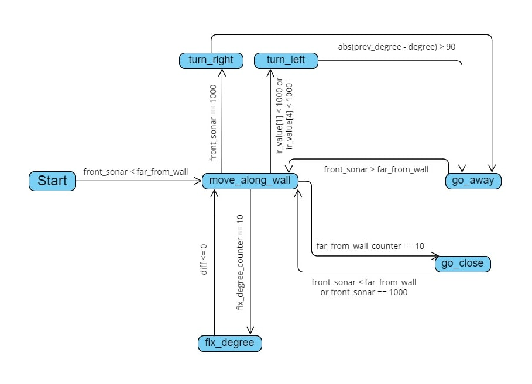

# Robot-Motion-Planning
In this project, Bug2 algorithm is implemented on an omnidirectional robot in Webots. the robot uses sonar and infrared sensors, GPS, camera, and deep learning algorithms to detect obstacles and its predefined destination.

## Preview
In these videos you can see how the robot will move toward the destination point in each algorithm:

## Algorithms
You can see the main idea of Bug2 algorithm and the state machine we designed for it in the following diagrams:

 
 

## How to run the simulation
Open the world file (worlds/current.wbt) in [Webots](https://cyberbotics.com/).

